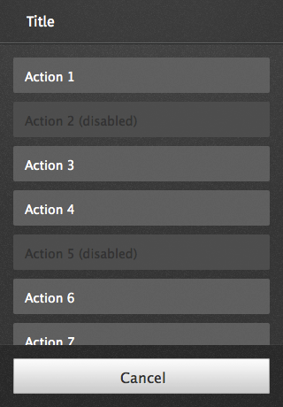

## Action menu

An action menu presents a list of actions, related to the app's content, from which the user may make a selection.

> ### Characteristics
> * Opened from buttons within app content; these buttons are often inside toolbars (for example, the Browser app's "Share" button).
> * Action menus contain one or more items.
> * These menus expand in height to accomodate their items, to a maximum of the screen's height. Once that maximum height is reached, the content becomes scrollable vertically. Generally, the best practice is to try to include no more than five items plus a menu title.
> * The title string is optional.
> * The menu is closed by one of:
>   * Selecting one of the actions.
>   * Tapping the "Cancel" button.

  <h4>Example</h4>
  <section class="example">
    
    <article class="full frame">
      <form role="dialog" onsubmit="return false;" data-type="action">
        <header>Title</header>
        <menu>
          <button>Action 1</button>
          <button>Action 2</button>
          <button>Action 3</button>
          <button>Cancel</button>
        </menu>
      </form>
    </article>
  </section>

  <h4>Css shared link</h4>
  <link rel="stylesheet" type="text/css" href="shared/style/action_menu.css">

  <h4>HTML code</h4>
  <form role="dialog" onsubmit="labelreturn false;" data-type="action">
  <header>Title</header>
  <menu>
    <button>Action 1</button>
    <button>Action 2</button>
    <button>Action 3</button>
    <button>Cancel</button>
  </menu>
</form>

