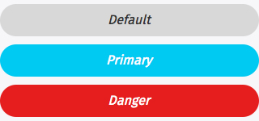
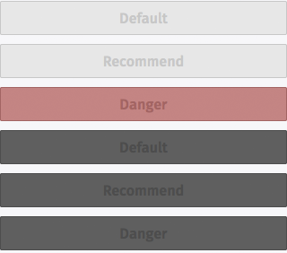
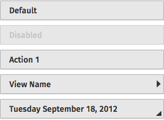

## Buttons

Buttons perform an action when tapped by the user. Firefox OS has a wide variety of button styles to accommodate different uses and contexts. 

> ### Characteristics
> * Buttons have two components: a visual target and a hit target. The visual target is the button the user sees on the screen. The hit target is an invisible area that responds to the tap. To minimize tapping errors, the hit target is typically larger than the visual target. 
> * Buttons have two states: normal and pressed.
> * Disabled buttons are buttons that do not respond to a tap. Disabled buttons are dimmed.

### Default
Default buttons are used when there are only a few actions and a list isn't needed. A primary action button uses a special highlight color to improve visibility and simplify the choice for the user. Buttons that have potentially negative consequences, such as deleting an item, are highlighted in red.

  <h4>Example</h4>
  <section class="example">
    
    <article class="frame">
      <button>Default</button>
      <a class="recommend" role="button" href="#">Primary</a>
      <button class="danger">Danger</button>
    </article>
  </section>

  <h4>Css shared link</h4>
  <link rel="stylesheet" type="text/css" href="shared/style/buttons.css">
  
  <h4>HTML code</h4>
  <button>Default</button>
  <a class="recommend" role="button" href="#">Recommend</a>
  <button class="danger">Danger</button>

### Disabled buttons
Disabled buttons do not respond to users' taps.

  <h4>Example</h4>
  <section class="example">
    
    <article class="frame">
      

        <button disabled="disabled">Default</button>
        <a class="recommend" role="button" aria-disabled="true" href="#">Recommend</a>
        <button class="danger" disabled="disabled">Danger</button>
      

      
<!-- disabled buttons over dark background -->
        <button disabled="disabled">Default</button>
        <button class="recommend" disabled="disabled">Recommend</button>
        <button class="danger" disabled="disabled">Danger</button>
      

    </article>
  </section>

  <h4>Css shared link</h4>
  <link rel="stylesheet" type="text/css" href="shared/style/buttons.css">
  
  <h4>HTML code</h4>
  

  <button disabled="disabled">Default</button>
  <a class="recommend" role="button" aria-disabled="true" href="#">Recommend</a>
  <button class="danger" disabled="disabled">Danger</button>

<!-- disabled buttons over dark background -->
  <button disabled="disabled">Default</button>
  <button class="recommend" disabled="disabled">Recommend</button>
  <button class="danger" disabled="disabled">Danger</button>



### List buttons
List buttons are used when displaying a list of actions, or to trigger the display of a value selector.

  <h4>Example</h4>
  <section class="example">
    
    <article class="frame">
      <ul>
        <li>
          <button>Default</button>
        </li>
        <li>
          <button disabled="disabled">Disabled</button>
        </li>
        <li><button>Action 1</button></li>
        <li><button class="icon icon-view">View Name</button></li>
        <li><button class="icon icon-dialog">Tuesday September 18, 2012</button></li>
      </ul>
    </article>
  </section>

  <h4>Css shared link</h4>
  <link rel="stylesheet" type="text/css" href="shared/style/buttons.css">

  <h4>HTML code</h4>
  <ul>
  <li>
    <button>Default</button>
  </li>
  <li>
    <button disabled="disabled">Disabled</button>
  </li>
  <li><button>Action 1</button></li>
  <li><button class="icon icon-view">View Name</button></li>
  <li><button class="icon icon-dialog">Tuesday September 18, 2012</button></li>
</ul>

