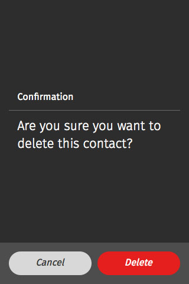
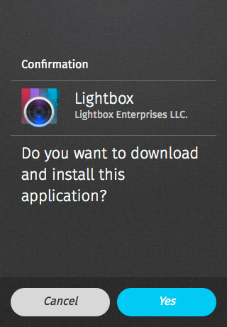

## Confirm

A confirmation prompt is used to confirm an action or inform the user of an event. Confirmation prompts are frequently used to confirm tasks that cannot be undone, such as permanently deleting an item. Confirmation prompts are designed to disrupt tasks and, as a result, should be used sparingly.

> ### Characteristics
> * Confirmation prompts are currently modal - they occupy the entire screen, and require user input to close them.

> #### A confirmation prompts consist of:
> * Title (optional)
> * Body
> * Icon (optional)
> * A Confirmation input button, whose label can be customized
> * An optional Cancel input button, whose label can be customized

### Default

  <h4>Example</h4>
  <section class="example">
    
    <article class="full frame">
      <form role="dialog" data-type="confirm">
        <section>
          <h1>Confirmation</h1><!-- this heading is optional -->
          
Are you sure you want to delete this contact?

        </section>
        <menu>
          <button>Cancel</button>
          <button class="danger">Delete</button>
        </menu>
      </form>
    </article>
  </section>

  <h4>Css shared link</h4>
  <link rel="stylesheet" type="text/css" href="shared/style/confirm.css">

  <h4>HTML code</h4>
  <form role="dialog" data-type="confirm">
  <section>
    <h1>Confirmation</h1><!-- this heading is optional -->
    
Are you sure you want to delete this contact?

  </section>
  <menu>
    <button>Cancel</button>
    <button class="danger">Delete</button>
  </menu>
</form>

### Confirm with content

  <h4>Example</h4>
  <section class="example">
    
    <article class="full frame">
      <form role="dialog" data-type="confirm">
        <section>
          <h1>Confirmation</h1>
          

            
            <strong>Lightbox</strong>
            <small>Lightbox Enterprises LLC.</small>
          

          
Do you want to download and install this application?

        </section>
        <menu>
          <button>Cancel</button>
          <button class="recommend">Yes</button>
        </menu>
      </form>
    </article>
  </section>

  <h4>Css shared link</h4>
  <link rel="stylesheet" type="text/css" href="shared/style/confirm.css">

  <h4>HTML code</h4>
  <form role="dialog" data-type="confirm">
  <section>
    <h1>Confirmation</h1>
    

      
      <strong>Lightbox</strong>
      <small>Lightbox Enterprises LLC.</small>
    

    
Do you want to download and install this application?

  </section>
  <menu>
    <button>Cancel</button>
    <button class="recommend">Yes</button>
  </menu>
</form>

