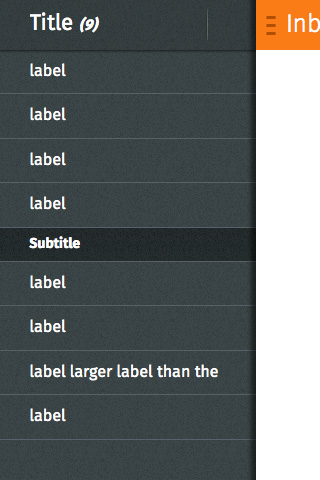

## Drawer

  <h4>Example</h4>
  <section class="example">
    
    <article class="full frame">
      <section data-type="sidebar">
        <header>
          <menu type="toolbar">
            <a href="#content">add</a>
          </menu>
          <h1>Title <em>(9)</em></h1>
        </header>
        <nav>
          <ul>
            <li><a href="#content">label</a></li>
            <li><a href="#content">label</a></li>
            <li><a href="#content">label</a></li>
            <li><a href="#content">label</a></li>
          </ul>
          <h2>Subtitle</h2>
          <ul>
            <li><a href="#content">label</a></li>
            <li><a href="#content">label</a></li>
            <li><a href="#content">label larger label than the </a></li>
            <li><a href="#content">label</a></li>
          </ul>
        </nav>
      </section>
      <section id="drawer" role="region">
        <header>
          <a href="#content">hide sidebar</a>
          <a href="#drawer_">show sidebar</a>
          <h1>Inbox</h1>
        </header>
        

      </section>
    </article>
  </section>

  <h4>Css shared link</h4>
  <link rel="stylesheet" type="text/css" href="shared/style_unstable/drawer.css">

  <h4>HTML code</h4>
  
<section data-type="sidebar">
  <header>
    <menu type="toolbar">
      <a href="#content">add</a>
    </menu>
    <h1>Title <em>(9)</em></h1>
  </header>
  <nav>
    <ul>
      <li><a href="#content">label</a></li>
      <li><a href="#content">label</a></li>
      <li><a href="#content">label</a></li>
      <li><a href="#content">label</a></li>
    </ul>
    <h2>Subtitle</h2>
    <ul>
      <li><a href="#content">label</a></li>
      <li><a href="#content">label</a></li>
      <li><a href="#content">label larger label than the </a></li>
      <li><a href="#content">label</a></li>
    </ul>
  </nav>
</section>
<section id="drawer" role="region">
  <header>
    <a href="#content">hide sidebar</a>
    <a href="#drawer_">show sidebar</a>
    <h1>Inbox</h1>
  </header>
  

</section>

