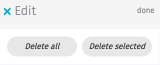

## Edit mode

State of an app where content becomes editable by the user (eg: deleting messages).

  <h4>Example</h4>
  <section class="example">
    
    <article class="edit-mode frame"></article>
  </section>

  <h4>Note</h4>
  <section class="note">
    
Use <code>&lt;button type="button"&gt;</code> in case you don't want your form to be submitted.

  </section>
  
  <h4>Css link</h4>
  <link href="(your styles folder)/style/edit_mode.css" rel="stylesheet" type="text/css">

  <h4>HTML code</h4>
  

