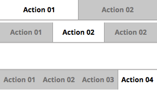

## Filters

Filters can be used for two purposes: data filtering, in which the user can view a single set of data in different ways (for example, the Calendar app uses filters to select the time scale to use when viewing data (that is, by day, week, or month); and secondary navigation (presenting a second set of tabs when tabs are already present in your user interface).

> ### Characteristics
> * Filters are presented as a horizontal sequence of buttons.
> * Only one button is focused at a time.
> * The best practice is to place filters within toolbars, so that they don't flow with content.
> * Left, middle, and right buttons can be styled uniquely. This lets you make, for example, the left and right ends of your bar take on a "sheen," or to make the bar rounded on the ends.
> * Filter buttons' widths vary depending on the number of filters in a single set.
> * You must have at least two and no more than five filters in a set.
> * A given set of filters may be labeled with either text or icons, but not both. Because filters’ heights are relatively small compared to tabs, text is typically the best practice.

  <h4>Example</h4>
  <section class="example">
    
    <article class="frame">
      <ul role="tablist" data-type="filter" data-items="2">
        <li id="filter1-1" role="tab"><a href="#filter1-1">Action 01</a></li>
        <li id="filter1-2" role="tab"><a href="#filter1-2">Action 02</a></li>
      </ul>
      <ul role="tablist" data-type="filter" data-items="3">
        <li id="filter2-1" role="tab"><a href="#filter2-1">Action 01</a></li>
        <li id="filter2-2" role="tab"><a href="#filter2-2">Action 02</a></li>
        <li id="filter2-3" role="tab"><a href="#filter2-3">Action 02</a></li>
      </ul>
      <ul class="bottom" role="tablist" data-type="filter" data-items="4">
        <li id="filter4-1" role="tab"><a href="#filter4-1">Action 01</a></li>
        <li id="filter4-2" role="tab"><a href="#filter4-2">Action 02</a></li>
        <li id="filter4-3" role="tab"><a href="#filter4-3">Action 03</a></li>
        <li id="filter4-4" role="tab"><a href="#filter4-4">Action 04</a></li>
      </ul>
    </article>
  </section>

  <label>Css shared link: (Both Tabs and Filters are in tabs.css)</label>
  <link rel="stylesheet" type="text/css" href="shared/style_unstable/tabs.css">

  <h4>HTML code</h4>
  <ul role="tablist" data-type="filter" data-items="2">
  <li id="filter1-1" role="tab"><a href="#filter1-1">Action 01</a></li>
  <li id="filter1-2" role="tab"><a href="#filter1-2">Action 02</a></li>
</ul>
<ul role="tablist" data-type="filter" data-items="3">
  <li id="filter2-1" role="tab"><a href="#filter2-1">Action 01</a></li>
  <li id="filter2-2" role="tab"><a href="#filter2-2">Action 02</a></li>
  <li id="filter2-3" role="tab"><a href="#filter2-3">Action 02</a></li>
</ul>
<ul class="bottom" role="tablist" data-type="filter" data-items="4">
  <li id="filter4-1" role="tab"><a href="#filter4-1">Action 01</a></li>
  <li id="filter4-2" role="tab"><a href="#filter4-2">Action 02</a></li>
  <li id="filter4-3" role="tab"><a href="#filter4-3">Action 03</a></li>
  <li id="filter4-4" role="tab"><a href="#filter4-4">Action 04</a></li>
</ul>

