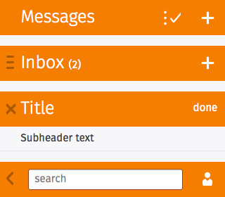
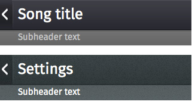

## Headers

Used for labeling the active view and providing top-level navigation and inputs for the active view.

### Characteristics

* A header is a horizontal bar the full width of the screen, which appears at the top of the screen in most apps.
* Headers float above content, with the option of flowing with content in special instances, such as in the Browser app.
* The heading's text provides the name of the current view.
* The heading may optionally include additional text; for example, in an email app, the number of unread messages may be displayed.
* Headers may include inputs for navigating and manipulating the current view.
* Most apps (full-screen games being an obvious exception) have a header.

### Default
  

  <h4>Example</h4>
  <section class="example">
    
    <article class="headers frame">
      <section role="region">
        <header>
          <menu type="toolbar">
            <a href="#">edit</a>
            <a href="#">add</a>
          </menu>
          <h1>Messages</h1>
        </header>
      </section>
      <section role="region">
        <header>
          <button>menu</button>
          <menu type="toolbar">
            <button>add</button>
          </menu>
          <h1>Inbox <em>(2)</em></h1>
        </header>
      </section>
      <section role="region">
        <header>
          <button>close</button>
          <menu type="toolbar"><button>done</button></menu>
          <h1>Title</h1>
        </header>
        <header>
          <h2>Subheader text</h2>
        </header>
      </section>
      <section role="region">
        <header>
          <button>back</button>
          <menu type="toolbar">
            <button>user</button>
          </menu>
          <form action="#">
            <input type="text" placeholder="search" required="required">
            <button type="reset">Remove text</button>
          </form>
        </header>
      </section>
    </article>
  </section>

  <h4>Css link</h4>
  <link href="(your styles folder)/style/headers.css" rel="stylesheet" type="text/css">

  <h4>HTML code</h4>
  <section role="region">
  <header>
    <menu type="toolbar">
      <a href="#">edit</a>
      <a href="#">add</a>
    </menu>
    <h1>Messages</h1>
  </header>
</section>
<section role="region">
  <header>
    <button>menu</button>
    <menu type="toolbar">
      <button>add</button>
    </menu>
    <h1>Inbox <em>(2)</em></h1>
  </header>
</section>
<section role="region">
  <header>
    <button>close</button>
    <menu type="toolbar"><button>done</button></menu>
    <h1>Title</h1>
  </header>
  <header>
    <h2>Subheader text</h2>
  </header>
</section>
<section role="region">
  <header>
    <button>back</button>
    <menu type="toolbar">
      <button>user</button>
    </menu>
    <form action="#">
      <input type="text" placeholder="search" required="required">
      <button type="reset">Remove text</button>
    </form>
  </header>
</section>

### Skins: dark and organic

  <h4>Example</h4>
  <section class="example">
    
    <article class="headers frame">
      <section class="skin-dark" role="region">
        <header>
          <a href="#">back</a>
          <h1>Song title</h1>
        </header>
        <header>
          <h2>Subheader text</h2>
        </header>
      </section>
      <section class="skin-organic" role="region">
        <header>
          <a href="#">back</a>
          <h1>Settings</h1>
        </header>
        <header>
          <h2>Subheader text</h2>
        </header>
      </section>
    </article>
  </section>

  <h4>Css link</h4>
  <link href="(your styles folder)/style/headers.css" rel="stylesheet" type="text/css">

  <h4>HTML code</h4>
  
<section class="skin-dark" role="region">
  <header>
    <a href="#">back</a>
    <h1>Song title</h1>
  </header>
  <header>
    <h2>Subheader text</h2>
  </header>
</section>
<section class="skin-organic" role="region">
  <header>
    <a href="#">back</a>
    <h1>Settings</h1>
  </header>
  <header>
    <h2>Subheader text</h2>
  </header>
</section>

