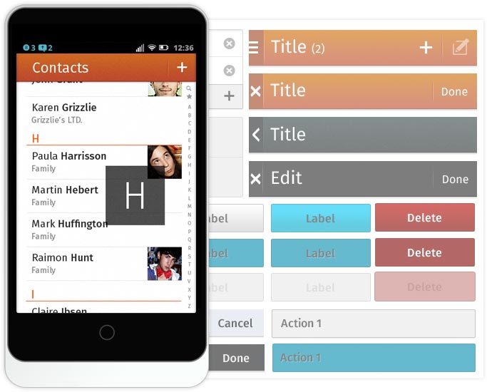

##### Reusable components such as headers, buttons, list components and many other user interface elements created in HTML and CSS. Use them to quickly build nice and consistent Firefox OS applications.

