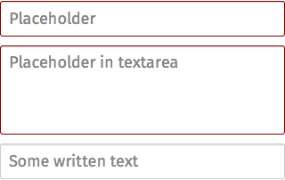
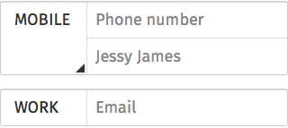
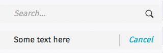

## Input areas

Activates/Deactivates a given item. It’s also used to select an element within a list.

  <ul>
    <li><a href="#input-default">Default</a></li>
    <li><a href="#input-fielset">Fieldset</a></li>
    <li><a href="#input-forms">Forms</a></li>
  </ul>

  

    <section class="example">
      
      <article class="frame">
        <form>
          

            <input type="text" placeholder="Placeholder" required="">
            <button type="reset">Clear</button>
          

          

            <textarea placeholder="Placeholder in textarea" required=""></textarea>
          

          

            <input type="text" placeholder="Placeholder" value="Some written text" required="">
            <button type="reset">Clear</button>
          

        </form>
      </article>
    </section>

    <label>Css shared link:</label>
    <link rel="stylesheet" type="text/css" href="shared/style/input_areas.css">

    <label>HTML code:</label>
    
<form>
  

    <input type="text" placeholder="Placeholder" required="">
    <button type="reset">Clear</button>
  

  

    <textarea placeholder="Placeholder in textarea" required=""></textarea>
  

  

    <input type="text" placeholder="Placeholder" value="Some written text" required="">
    <button type="reset">Clear</button>
  

</form>
  

  

    <section class="example">
      
      <article class="frame">
        <form>
          <fieldset>
            <legend class="action">Mobile</legend>
            <section>
              

                <input type="tel" placeholder="Phone number" required="">
                <button type="reset">Clear</button>
              

              

                <input type="text" placeholder="Name" value="Jessy James" required="">
                <button type="reset">Clear</button>
              

            </section>
          </fieldset>
          <fieldset>
            <legend>Work</legend>
            <section>
              

                <input type="tel" placeholder="Email" required="">
                <button type="reset">Clear</button>
              

            </section>
          </fieldset>
        </form>
      </article>
    </section>

    <label>Css shared link:</label>
    <link rel="stylesheet" type="text/css" href="shared/style/input_areas.css">

    <label>HTML code:</label>
    
<form>
  <fieldset>
    <legend class="action">Mobile</legend>
    <section>
      

        <input type="tel" placeholder="Phone number" required="">
        <button type="reset">Clear</button>
      

      

        <input type="text" placeholder="Name" value="Jessy James" required="">
        <button type="reset">Clear</button>
      

    </section>
  </fieldset>
  <fieldset>
    <legend>Work</legend>
    <section>
      

        <input type="tel" placeholder="Email" required="">
        <button type="reset">Clear</button>
      

    </section>
  </fieldset>
</form>
  

  

    <section class="example">
      
      <article class="input frame">
        <!-- form used at the top of the page with fixed/absolute position and content scrolls underneath -->
        <form role="search">
          <button type="submit">Cancel</button>
          

            <input type="text" placeholder="Search..." required="">
            <button type="reset">Clear</button>
          

        </form>
        <!-- form used under a header, this form scrolls together with the content underneath the header -->
        <section role="region">
          <header>
              <!-- here should be the content of the header -->
          </header>
          <form role="search" class="full">
            <button type="submit">Send</button>
            

              <input type="text" placeholder="Search..." required="">
              <button type="reset">Clear</button>
            

          </form>
        </section>
        <form role="search" class="bottom">
          <button class="icon icon-attachment">Attachment</button>
          <button type="submit" disabled="">Send</button>
          

            <input type="text" placeholder="Search..." required="">
            <button type="reset">Clear</button>
          

        </form>
        <form role="search" class="bottom">
          <button class="icon icon-attachment">Attachment</button>
          <button type="submit">Send</button>
          

            <textarea placeholder="Search..." required="">Some text here</textarea>
          

        </form>
      </article>
    </section>

    <label>Css shared link:</label>
    <link rel="stylesheet" type="text/css" href="shared/style/input_areas.css">

    <label>HTML code:</label>
    
<!-- form used at the top of the page with fixed/absolute position and content scrolls underneath -->
<form role="search">
  <button type="submit">Cancel</button>
  

    <input type="text" placeholder="Search..." required="">
    <button type="reset">Clear</button>
  

</form>
<!-- form used under a header, this form scrolls together with the content underneath the header -->
<section role="region">
  <header>
      <!-- here should be the content of the header -->
  </header>
  <form role="search" class="full">
    <button type="submit">Send</button>
    

      <input type="text" placeholder="Search..." required="">
      <button type="reset">Clear</button>
    

  </form>
</section>
<form role="search" class="bottom">
  <button class="icon icon-attachment">Attachment</button>
  <button type="submit" disabled="">Send</button>
  

    <input type="text" placeholder="Search..." required="">
    <button type="reset">Clear</button>
  

</form>
<form role="search" class="bottom">
  <button class="icon icon-attachment">Attachment</button>
  <button type="submit">Send</button>
  

    <textarea placeholder="Search..." required="">Some text here</textarea>
  

</form>
  

