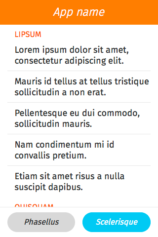

## Layout

This utility will help us creating most common layout structures.

### Basic

You could find this structure in most apps in Firefox OS: Fixed header and footer with scrollable content.

Using `layout.css` is easy to achieve it, using `display: flex` in your main container and classes `fit` and `scroll` in your content section.

  <h4>Example</h4>
  <section class="example">
    
    <article class="full flex frame white"></article>
  </section>

  <h4>Css link</h4>
  <link href="(your styles folder)/style/layout.css" rel="stylesheet" type="text/css">

  <h4>HTML code</h4>
  

