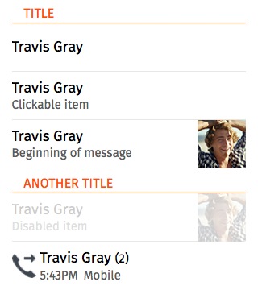
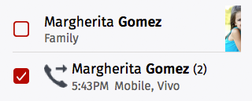

## Lists

Lists are used to display a set of consecutive items, such as a list of contacts or a list of messages.

### Characteristics

* List items may vary in height (from one to three rows in a single item).
* List items may be as simple as just a text string, to including images, text, and buttons.
* Lists are comprised of rows, with optional section headers.

### Default

  <h4>Example</h4>
  <section class="example">
    
    <article class="frame">
      <section data-type="list">
        <header>Title</header>
        <ul>
          <li>
            
Margherita <strong>Gomez</strong>

          </li>
          <li>
            <a href="#">
              
Margherita Clickable <strong>Gomez</strong>

            </a>
          </li>
          <li>
            <aside class="pack-end">
              
            </aside>
            <a href="#">
              
Margherita <strong>Gomez</strong>

              
Family

            </a>
          </li>
        </ul>
        <header>Another title</header>
        <ul>
          <li aria-disabled="true">
            <aside class="pack-end">
              
            </aside>
            <a href="#">
              
Margherita <strong>Gomez</strong>

              
Family

            </a>
          </li>
          <li>
            <a href="#">
              <aside class="icon icon-callout">
                asidecall
              </aside>
              

                Margherita <strong>Gomez</strong>
                <em>(2)</em>
              

              

                <time datetime="17:43">5:43PM</time>
                Mobile, Vivo
              

            </a>
          </li>
        </ul>
      </section>
    </article>
  </section>

  <h4>Css shared link</h4>
  <link rel="stylesheet" type="text/css" href="shared/style_unstable/lists.css">

  <h4>HTML code</h4>
  
<section data-type="list">
  <header>Title</header>
  <ul>
    <li>
      
Margherita <strong>Gomez</strong>

    </li>
    <li>
      <a href="#">
        
Margherita Clickable <strong>Gomez</strong>

      </a>
    </li>
    <li>
      <aside class="pack-end">
        
      </aside>
      <a href="#">
        
Margherita <strong>Gomez</strong>

        
Family

      </a>
    </li>
  </ul>
  <header>Another title</header>
  <ul>
    <li aria-disabled="true">
      <aside class="pack-end">
        
      </aside>
      <a href="#">
        
Margherita <strong>Gomez</strong>

        
Family

      </a>
    </li>
    <li>
      <a href="#">
        <aside class="icon icon-callout">
          asidecall
        </aside>
        

          Margherita <strong>Gomez</strong>
          <em>(2)</em>
        

        

          <time datetime="17:43">5:43PM</time>
          Mobile, Vivo
        

      </a>
    </li>
  </ul>
</section>

### Edit mode

  <h4>Example</h4>
  <section class="example">
    
    <article class="frame">
      <section data-type="list">
        <ul data-type="edit">
          <li>
            <label class="danger">
              <input type="checkbox">
              
            </label>
            <aside class="pack-end">
              
            </aside>
            <a href="#">
              
Margherita <strong>Gomez</strong>

              
Family

            </a>
          </li>
          <li>
            <label class="danger">
              <input type="checkbox">
              
            </label>
            <a href="#">
              <aside class="icon icon-callout"></aside>
              

                Margherita <strong>Gomez</strong>
                <em>(2)</em>
              

              

                <time datetime="17:43">5:43PM</time>
                Mobile, Vivo
              

            </a>
          </li>
        </ul>
      </section>
    </article>
  </section>

  <h4>Css shared link</h4>
  <link rel="stylesheet" type="text/css" href="shared/style_unstable/lists.css">

  <h4>HTML code</h4>
  
<section data-type="list">
  <ul data-type="edit">
    <li>
      <label class="danger">
        <input type="checkbox">
        
      </label>
      <aside class="pack-end">
        
      </aside>
      <a href="#">
        
Margherita <strong>Gomez</strong>

        
Family

      </a>
    </li>
    <li>
      <label class="danger">
        <input type="checkbox">
        
      </label>
      <a href="#">
        <aside class="icon icon-callout"></aside>
        

          Margherita <strong>Gomez</strong>
          <em>(2)</em>
        

        

          <time datetime="17:43">5:43PM</time>
          Mobile, Vivo
        

      </a>
    </li>
  </ul>
</section>

