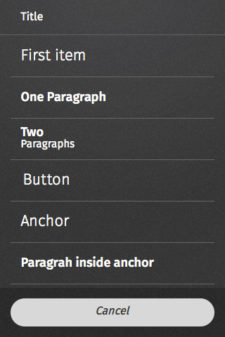

## Object menu

An Object menu (contextual menu) presents a list of actions, related to the app's content, from which the user may make a selection.

> ### Characteristics
> * Object menus contain one or more items.
> * These menus expand in height to accomodate their items, to a maximum of the screen's height. Once that maximum height is reached, the content becomes scrollable vertically. Generally, the best practice is to try to include no more than five items plus a menu title.
> * The title string is required.
> * The menu is closed by one of:
>   * Selecting one of the actions.
>   * Tapping the "Cancel" button.
>   * Opposite to Action menu, Object menu can have several main actions.

  <h4>Example</h4>
  <section class="example">
    
    <article class="frame full"></article>
  </section>

  <h4>Css link</h4>
  <link href="(your styles folder)/style/object_menu.css" rel="stylesheet" type="text/css">

  <h4>HTML code</h4>
  

