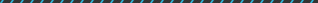
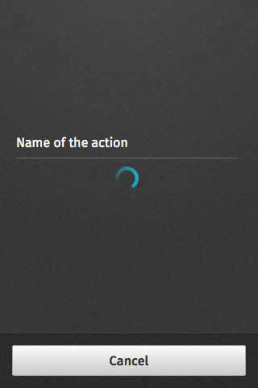
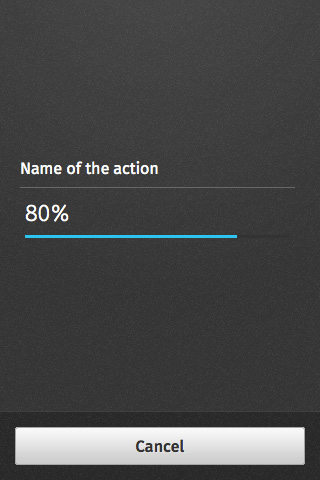
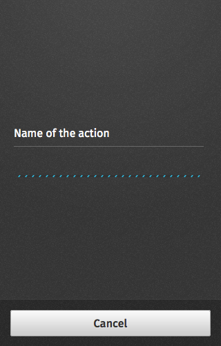
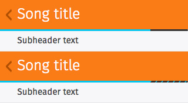
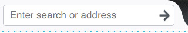

## Progress and activity

Used for providing user with visual feedback that a process is active.

### Inline

  <a class="dropdown-toggle" href="#">Dropdown trigger</a>
  <ul class="dropdown-menu">
    <li><a tabindex="-1" href="#progress-spinner">Spinner</a></li>
    <li><a tabindex="-1" href="#progress-activity">Activity bar</a></li>
    <li><a tabindex="-1" href="#progress-progress">Progress bar</a></li>
    <li><a tabindex="-1" href="#progress-progress-activity">Progress + activity bar</a></li>
  </ul>

<ul class="dropdown-content">
  <li id="progress-spinner">
    <h4>Example</h4>
    <section class="example">
      
      <article class="frame"></article>
    </section>

    <h4>Css link</h4>
    <link href="(your styles folder)/style/progress_activity.css" rel="stylesheet" type="text/css">

    <h4>HTML code</h4>
    
  </li>

  <li id="progress-activity">
    <h4>Example</h4>
    <section class="example">
      
      <article class="frame"></article>
    </section>

    <h4>Css link</h4>
    <link href="(your styles folder)/style/progress_activity.css" rel="stylesheet" type="text/css">

    <h4>HTML code</h4>
    
  </li>
  
  <li id="progress-progress">
    <h4>Example</h4>
    <section class="example">
      
      <article class="frame"></article>
    </section>

    <h4>Css link</h4>
    <link href="(your styles folder)/style/progress_activity.css" rel="stylesheet" type="text/css">

    <h4>HTML code</h4>
    
  </li>

  <li id="progress-progress-activity">
    <h4>Example</h4>
    <section class="example">
      
      <article class="frame"></article>
    </section>

    <h4>Css link</h4>
    <link href="(your styles folder)/style/progress_activity.css" rel="stylesheet" type="text/css">

    <h4>HTML code</h4>
    
  </li>
</ul>

### Modal

  <a class="dropdown-toggle" href="#">Dropdown trigger</a>
  <ul class="dropdown-menu">
    <li><a tabindex="-1" href="#progress-modal-spinner">Spinner</a></li>
    <li><a tabindex="-1" href="#progress-modal-progress">Progress bar</a></li>
    <li><a tabindex="-1" href="#progress-modal-activity">Activity bar</a></li>
  </ul>

<ul class="dropdown-content">
  <li id="progress-modal-spinner">
    <h4>Example</h4>
    <section class="example">
      
      <article class="full frame"></article>
    </section>

    <h4>Css link</h4>
    <link href="(your styles folder)/style/progress_activity.css" rel="stylesheet" type="text/css">

    <h4>HTML code</h4>
    
  </li>

  <li id="progress-modal-progress">
    <h4>Example</h4>
    <section class="example">
      
      <article class="full frame"></article>
    </section>

    <h4>Css link</h4>
    <link href="(your styles folder)/style/progress_activity.css" rel="stylesheet" type="text/css">

    <h4>HTML code</h4>
    
  </li>
  
  <li id="progress-modal-activity">
    <h4>Example</h4>
    <section class="example">
      
      <article class="full frame"></article>
    </section>

    <h4>Css link</h4>
    <link href="(your styles folder)/style/progress_activity.css" rel="stylesheet" type="text/css">

    <h4>HTML code</h4>
    
  </li>
</ul>

### Header

  <a class="dropdown-toggle" href="#">Dropdown trigger</a>
  <ul class="dropdown-menu">
    <li><a tabindex="-1" href="#progress-header">Progress</a></li>
    <li><a tabindex="-1" href="#progress-header-activity">Activity bar in light Headers</a></li>
  </ul>

<ul class="dropdown-content">
  <li id="progress-header">
    <h4>Example</h4>
    <section class="example">
      
      <article class="frame"></article>
    </section>

    <h4>Css link</h4>
    <link href="(your styles folder)/style/progress_activity.css" rel="stylesheet" type="text/css">

    <h4>HTML code</h4>
    
  </li>

  <li id="progress-header-activity">
    <h4>Example</h4>
    <section class="example">
      
      <article class="frame"></article>
    </section>

    <h4>Css link</h4>
    <link href="(your styles folder)/style/progress_activity.css" rel="stylesheet" type="text/css">

    <h4>HTML code</h4>
    
  </li>
</ul>

