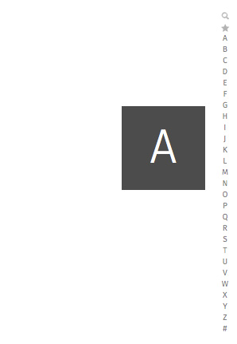

## Scrolling

Used for vertically slide text, images and/or video across the device's display.

  <section class="example">
    
    <article class="frame">
      <section role="region" id="main">
        <nav data-type="scrollbar">
          
A

          <ol>
            <li><a href="#">Search</a></li>
            <li><a href="#">favorites</a></li>
            <li><a href="#">A</a></li>
            <li><a href="#">B</a></li>
            <li><a href="#">C</a></li>
            <li><a href="#">D</a></li>
            <li><a href="#">E</a></li>
            <li><a href="#">F</a></li>
            <li><a href="#">G</a></li>
            <li><a href="#">H</a></li>
            <li><a href="#">I</a></li>
            <li><a href="#">J</a></li>
            <li><a href="#">K</a></li>
            <li><a href="#">L</a></li>
            <li><a href="#">M</a></li>
            <li><a href="#">N</a></li>
            <li><a href="#">O</a></li>
            <li><a href="#">P</a></li>
            <li><a href="#">Q</a></li>
            <li><a href="#">R</a></li>
            <li><a href="#">S</a></li>
            <li><a href="#">T</a></li>
            <li><a href="#">U</a></li>
            <li><a href="#">V</a></li>
            <li><a href="#">W</a></li>
            <li><a href="#">X</a></li>
            <li><a href="#">Y</a></li>
            <li><a href="#">Z</a></li>
            <li><a href="#">#</a></li>
          </ol>
        </nav>
      </section>
    </article>
  </section>

  <label>Css shared link:</label>
  <link rel="stylesheet" type="text/css" href="shared/style_unstable/scrolling.css">

  <label>HTML code:</label>
  
<section role="region" id="main">
  <nav data-type="scrollbar">
    
A

    <ol>
      <li><a href="#">Search</a></li>
      <li><a href="#">favorites</a></li>
      <li><a href="#">A</a></li>
      <li><a href="#">B</a></li>
      <li><a href="#">C</a></li>
      <li><a href="#">D</a></li>
      <li><a href="#">E</a></li>
      <li><a href="#">F</a></li>
      <li><a href="#">G</a></li>
      <li><a href="#">H</a></li>
      <li><a href="#">I</a></li>
      <li><a href="#">J</a></li>
      <li><a href="#">K</a></li>
      <li><a href="#">L</a></li>
      <li><a href="#">M</a></li>
      <li><a href="#">N</a></li>
      <li><a href="#">O</a></li>
      <li><a href="#">P</a></li>
      <li><a href="#">Q</a></li>
      <li><a href="#">R</a></li>
      <li><a href="#">S</a></li>
      <li><a href="#">T</a></li>
      <li><a href="#">U</a></li>
      <li><a href="#">V</a></li>
      <li><a href="#">W</a></li>
      <li><a href="#">X</a></li>
      <li><a href="#">Y</a></li>
      <li><a href="#">Z</a></li>
      <li><a href="#">#</a></li>
    </ol>
  </nav>
</section>

