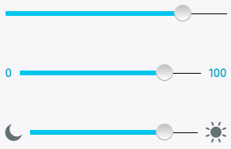

## Seek bars

Used for scrolling through content (i.e. a song or video).

  <h4>Example</h4>
  <section class="example">
    
    <article class="seekbars frame"></article>
  </section>

  <h4>Css link</h4>
  <link href="(your styles folder)/style_unstable/seekbars.css" rel="stylesheet" type="text/css">

  <h4>HTML code</h4>
  

