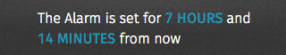

## Status

Relays information to the user in a transitory fashion, typically to confirm a user action or to alert the user to a system event. Sometimes status bars are referred to as “banners.”

  <h4>Example</h4>
  <section class="example">
    
    <article class="status frame">
      <section role="status">
        
The Alarm is set for <strong>7 hours</strong> and <strong>14 minutes</strong> from now

      </section>
    </article>
  </section>

  <h4>Css shared link</h4>
  <link rel="stylesheet" type="text/css" href="shared/style/status.css">

  <h4>HTML code</h4>
  <section role="status">
  
The Alarm is set for <strong>7 hours</strong> and <strong>14 minutes</strong> from now

</section>

