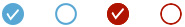
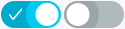

## Switches

Activates/Deactivates a given item. It’s also used to select an element within a list.

### Checkboxes

  <h4>Example</h4>
  <section class="example">
    
    <article class="frame">
      <label>
        <input type="checkbox" checked="">
        
      </label>
      <label>
        <input type="checkbox">
        
      </label>
      <label class="danger">
        <input type="checkbox" checked="">
        
      </label>
      <label class="danger">
        <input type="checkbox">
        
      </label>
    </article>
  </section>

  <h4>Css shared link</h4>
  <link rel="stylesheet" type="text/css" href="shared/style/switches.css">

  <h4>HTML code</h4>
  
<label>
  <input type="checkbox" checked="">
  
</label>
<label>
  <input type="checkbox">
  
</label>
<label class="danger">
  <input type="checkbox" checked="">
  
</label>
<label class="danger">
  <input type="checkbox">
  
</label>

### Radio buttons

  <h4>Example</h4>
  <section class="example">
    
    <article class="frame">
      <label>
        <input type="radio" name="example" checked="">
        
      </label>
      <label>
        <input type="radio" name="example">
        
      </label>
      <label class="danger">
        <input type="radio" name="example2" checked="">
        
      </label>
      <label class="danger">
        <input type="radio" name="example2">
        
      </label>
    </article>
  </section>

  <h4>Css shared link</h4>
  <link rel="stylesheet" type="text/css" href="shared/style/switches.css">

  <h4>HTML code</h4>
  
<label>
  <input type="radio" name="example" checked="">
  
</label>
<label>
  <input type="radio" name="example">
  
</label>
<label class="danger">
  <input type="radio" name="example2" checked="">
  
</label>
<label class="danger">
  <input type="radio" name="example2">
  
</label>

### Switches

  <h4>Example</h4>
  <section class="example">
    
    <article class="switch frame">
      <label>
        <input type="checkbox" data-type="switch" checked="">
        
      </label>
      <label>
        <input type="checkbox" data-type="switch">
        
      </label>
    </article>
  </section>

  <h4>Css shared link</h4>
  <link rel="stylesheet" type="text/css" href="shared/style/switches.css">

  <h4>HTML code</h4>
  
<label>
  <input type="checkbox" data-type="switch" checked="">
  
</label>
<label>
  <input type="checkbox" data-type="switch">
  
</label>

