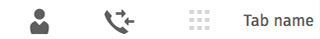

## Tabs

Tabs allow users to navigate between multiple views within a single screen.

  <h4>Example</h4>
  <section class="example">
    
    <article class="tab frame"></article>
  </section>

  <h4>Note</h4>
  <section class="note">
    
This example uses Gaia <a href="http://localhost:4000/building-blocks/icon-font.html">Icon Font</a>. For more details, please follow the link.

  </section>

  <h4>Css link</h4>
  <link href="(your styles folder)/style/tabs.css" rel="stylesheet" type="text/css">

  <h4>HTML code</h4>
  

