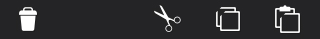

## Toolbars

Contains actions, indicators, and navigation associated with the current view (eg: Delete selected items, Refresh content)

  <section class="example">
    
    <article class="frame">
      

        <ul>
          <li><button class="pack-icon-delete">Delete</button></li>
        </ul>
        <ul>
          <li><button class="pack-icon-mark">Mark</button></li>
          <li><button class="pack-icon-send">Send</button></li>
          <li><button class="pack-icon-move">Move</button></li>
          <li><button class="pack-icon-share">Share</button></li>
        </ul>
      

    </article>
  </section>

  <label>Css shared link:</label>
  <link rel="stylesheet" type="text/css" href="shared/style_unstable/toolbars.css">

  <label>HTML code:</label>
  

  <ul>
    <li><button class="pack-icon-delete">Delete</button></li>
  </ul>
  <ul>
    <li><button class="pack-icon-mark">Mark</button></li>
    <li><button class="pack-icon-send">Send</button></li>
    <li><button class="pack-icon-move">Move</button></li>
    <li><button class="pack-icon-share">Share</button></li>
  </ul>



