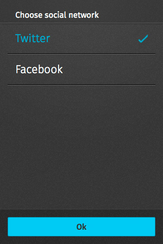
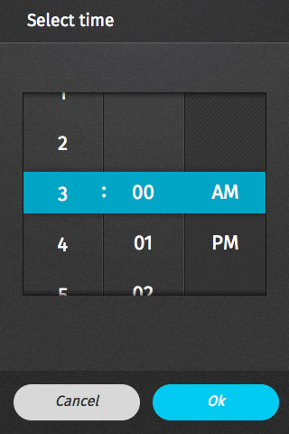
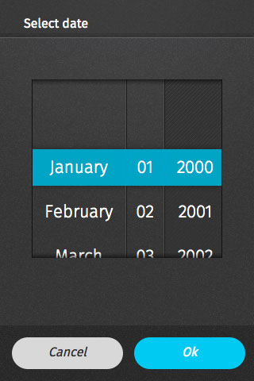

## Value selectors

(SYSTEM COMPONENT: This is how `<select>`, `<input type="time" />` and `<input type="date" />` are displayed in Firefox OS)

Value selectors allow users to select one of more values from a single form field.

### Single selector

  <h4>Example</h4>
  <section class="example">
    
    <article class="full frame">
      <form onsubmit="return false;" data-type="value-selector" role="dialog">
        <section>
          <h1>Choose social network</h1>
          <ul role="listbox">
            <li role="option">
              <label for="option-1">
                <input type="radio" id="option-1" name="option">
                Twitter
              </label>
            </li>
            <li role="option">
              <label for="option-2">
                <input type="radio" id="option-2" name="option">
                Facebook
              </label>
            </li>
          </ul>
        </section>
        <menu>
          <button class="recommend full">Ok</button>
        </menu>
      </form>
      </article>
  </section>

  <h4>To launch it use:</h4>
  
<select>
  <option>Option 1</option>
  <option>Option 2</option>
</select>

### Multiple selector

  <h4>Example</h4>
  <section class="example">
    
    <article class="full frame">
      <form onsubmit="return false;" data-type="value-selector" role="dialog">
        <section class="scrollable">
          <h1>Choose your option(s)</h1>
          <ul aria-multiselectable="true" role="listbox">
            <li role="option">
              <label for="option1">
                <input type="checkbox" id="option1">
                Option 1
              </label>
            </li>
            <li role="option">
              <label for="option2">
                <input type="checkbox" id="option2">
                Option 2
              </label>
            </li>
            <li role="option">
              <label for="option3">
                <input type="checkbox" id="option3">
                Option 3
              </label>
            </li>
            <li role="option">
              <label for="option4">
                <input type="checkbox" id="option4">
                Option 4
              </label>
            </li>
            <li role="option">
              <label for="option5">
                <input type="checkbox" id="option5">
                Option 5
              </label>
            </li>
            <li role="option">
              <label for="option6">
                <input type="checkbox" id="option6">
                Option 6
              </label>
            </li>
            <li role="option">
              <label for="option7">
                <input type="checkbox" id="option7">
                Option 7
              </label>
            </li>
            <li role="option">
              <label for="option8">
                <input type="checkbox" id="option8">
                Option 8
              </label>
            </li>
            <li role="option">
              <label for="option9">
                <input type="checkbox" id="option9">
                Option 9
              </label>
            </li>
          </ul>
        </section>
        <menu>
          <button class="recommend full">Ok</button>
        </menu>
      </form>
    </article>
  </section>

  <h4>To launch it use:</h4>
  
<select multiple="true">
  <option>Option 1</option>
  <option>Option 2</option>
  <option>Option 3</option>
  <option>Option 4</option>
  <option>Option 5</option>
  <option>Option 6</option>
  <option>Option 7</option>
  <option>Option 8</option>
  <option>Option 9</option>
</select>

### Time selector

  <h4>Example</h4>
  <section class="example">
    
    <article class="full frame">
      <form onsubmit="return false;" data-type="value-selector" role="dialog">
        <section id="time-picker">
          <h1>Select time</h1>
          

            

            

            

              <ul class="picker-unit">
                <li>1</li>
                <li>2</li>
                <li>3</li>
                <li>4</li>
                <li>5</li>
                <li>6</li>
                <li>7</li>
                <li>8</li>
                <li>9</li>
                <li>10</li>
                <li>11</li>
                <li>12</li>
              </ul>
            

            

              <ul class="picker-unit">
                <li>00</li><li>01</li><li>02</li><li>03</li><li>04</li>
                <li>05</li><li>06</li><li>07</li><li>08</li><li>09</li>
                <li>10</li><li>11</li><li>12</li><li>13</li><li>14</li>
                <li>15</li><li>16</li><li>17</li><li>18</li><li>19</li>
                <li>20</li><li>21</li><li>22</li><li>23</li><li>24</li>
                <li>25</li><li>26</li><li>27</li><li>28</li><li>29</li>
                <li>30</li><li>31</li><li>32</li><li>33</li><li>34</li>
                <li>35</li><li>36</li><li>37</li><li>38</li><li>39</li>
                <li>40</li><li>41</li><li>42</li><li>43</li><li>44</li>
                <li>45</li><li>46</li><li>47</li><li>48</li><li>49</li>
                <li>50</li><li>51</li><li>52</li><li>53</li><li>54</li>
                <li>55</li><li>56</li><li>57</li><li>58</li><li>59</li>
              </ul>
            

            

              <ul class="picker-unit">
                <li>AM</li>
                <li>PM</li>
              </ul>
            

            
:

            

          

        </section>
        <menu>
          <button>Cancel</button>
          <button class="recommend">Ok</button>
        </menu>
      </form>
    </article>
  </section>

  <h4>To launch it use:</h4>
  
<input type="time" />

### Date selector

  <h4>Example</h4>
  <section class="example">
    
    <article class="full frame">
      <form onsubmit="return false;" data-type="value-selector" role="dialog">
        <section id="date-picker">
          <h1>Select date</h1>
          

            

            

            

              <ul class="picker-unit">
                <li>January</li>
                <li>February</li>
                <li>March</li>
                <li>April</li>
                <li>May</li>
                <li>June</li>
                <li>July</li>
                <li>August</li>
                <li>September</li>
                <li>October</li>
                <li>November</li>
                <li>December</li>
              </ul>
            

            

              <ul class="picker-unit">
                <li>01</li><li>02</li><li>03</li><li>04</li>
                <li>05</li><li>06</li><li>07</li><li>08</li><li>09</li>
                <li>10</li><li>11</li><li>12</li><li>13</li><li>14</li>
                <li>15</li><li>16</li><li>17</li><li>18</li><li>19</li>
                <li>20</li><li>21</li><li>22</li><li>23</li><li>24</li>
                <li>25</li><li>26</li><li>27</li><li>28</li><li>29</li>
                <li>30</li><li>31
              </ul>
            

            

              <ul class="picker-unit">
                <li>2000</li><li>2001</li><li>2002</li><li>2003</li><li>2004</li>
                <li>2005</li><li>2006</li><li>2007</li><li>2008</li><li>2009</li>
                <li>2010</li><li>2011</li><li>2012</li><li>2013</li><li>2014</li>
              </ul>
            

            

            

          

        </section>
        <menu>
          <button>Cancel</button>
          <button class="recommend">Ok</button>
        </menu>
      </form>
    </article>
  </section>

  <h4>To launch it use:</h4>
  
<input type="date" />

