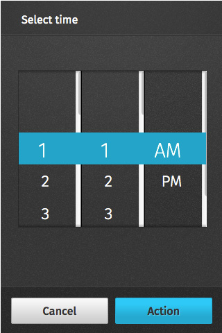

## Value selectors

(SYSTEM COMPONENT: This is how `<select>` and `<input type="time" />` will be displayed in Firefox OS)

Value selectors allow users to select one of more values from a single form field.

### Single selector

  <h4>Example</h4>
  <section class="example">
    
    <article class="full frame">
      <form onsubmit="return false;" data-type="value" role="dialog">
        <section>
          <h1>Choose social network</h1>
          <ul role="listbox">
            <li role="option">
              <label for="option-1">
                <input type="radio" id="option-1" name="option">
                Twitter
              </label>
            </li>
            <li role="option">
              <label for="option-2">
                <input type="radio" id="option-2" name="option">
                Facebook
              </label>
            </li>
          </ul>
        </section>
        <menu>
          <button class="full">Cancel</button>
        </menu>
      </form>
      </article>
  </section>

  <h4>To launch it use:</h4>
  
<select>
  <option>Option 1</option>
  <option>Option 2</option>
</select>

### Multiple selector

  <h4>Example</h4>
  <section class="example">
    
    <article class="full frame">
      <form onsubmit="return false;" data-type="value" role="dialog">
        <section class="scrollable">
          <h1>Choose your option(s)</h1>
          <ul aria-multiselectable="true" role="listbox">
            <li role="option">
              <label for="option1">
                <input type="checkbox" id="option1">
                Option 1
              </label>
            </li>
            <li role="option">
              <label for="option2">
                <input type="checkbox" id="option2">
                Option 2
              </label>
            </li>
            <li role="option">
              <label for="option3">
                <input type="checkbox" id="option3">
                Option 3
              </label>
            </li>
            <li role="option">
              <label for="option4">
                <input type="checkbox" id="option4">
                Option 4
              </label>
            </li>
            <li role="option">
              <label for="option5">
                <input type="checkbox" id="option5">
                Option 5
              </label>
            </li>
            <li role="option">
              <label for="option6">
                <input type="checkbox" id="option6">
                Option 6
              </label>
            </li>
            <li role="option">
              <label for="option7">
                <input type="checkbox" id="option7">
                Option 7
              </label>
            </li>
            <li role="option">
              <label for="option8">
                <input type="checkbox" id="option8">
                Option 8
              </label>
            </li>
            <li role="option">
              <label for="option9">
                <input type="checkbox" id="option9">
                Option 9
              </label>
            </li>
          </ul>
        </section>
        <menu>
          <button>Cancel</button>
          <button class="recommend">Action</button>
        </menu>
      </form>
    </article>
  </section>

  <h4>To launch it use:</h4>
  
<select multiple="true">
  <option>Option 1</option>
  <option>Option 2</option>
  <option>Option 3</option>
  <option>Option 4</option>
  <option>Option 5</option>
  <option>Option 6</option>
  <option>Option 7</option>
  <option>Option 8</option>
  <option>Option 9</option>
</select>

### Time selector

  <h4>Example</h4>
  <section class="example">
    
    <article class="full frame">
      <form onsubmit="return false;" data-type="time" role="dialog">
        <h1>Select time</h1>
        <section role="spinbutton">
          

            
            
            
          

          

            <ol role="listbox" id="hours">
              <li role="option"><a href="#">1</a></li>
              <li role="option"><a href="#">2</a></li>
              <li role="option"><a href="#">3</a></li>
              <li role="option"><a href="#">4</a></li>
              <li role="option"><a href="#">5</a></li>
              <li role="option"><a href="#">6</a></li>
              <li role="option"><a href="#">7</a></li>
              <li role="option"><a href="#">8</a></li>
              <li role="option"><a href="#">9</a></li>
              <li role="option"><a href="#">10</a></li>
              <li role="option"><a href="#">11</a></li>
              <li role="option"><a href="#">12</a></li>
            </ol>
          

          

            <ol role="listbox" id="minutes">
              <li role="option"><a href="#">1</a></li>
              <li role="option"><a href="#">2</a></li>
              <li role="option"><a href="#">3</a></li>
              <li role="option"><a href="#">4</a></li>
              <li role="option"><a href="#">5</a></li>
              <li role="option"><a href="#">6</a></li>
              <li role="option"><a href="#">7</a></li>
              <li role="option"><a href="#">8</a></li>
              <li role="option"><a href="#">9</a></li>
              <li role="option"><a href="#">10</a></li>
              <li role="option"><a href="#">11</a></li>
              <li role="option"><a href="#">12</a></li>
            </ol>
          

          

            <ul role="listbox" id="mode">
              <li role="option"><a href="#">AM</a></li>
              <li role="option"><a href="#">PM</a></li>
            </ul>
          

        </section>
        <menu>
          <button>Cancel</button>
          <button class="recommend">Action</button>
        </menu>
      </form>
    </article>
  </section>

  <h4>To launch it use:</h4>
  
<input type="time" />

