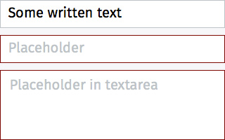
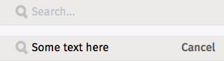

## Input areas

An input area is a data entry field. There are many variations on what an input area can look like - they can be as simple as a text entry field, and as complex as a multi-part entry field with text entry, value selectors, and buttons. 

### Default

  <h4>Example</h4>
  <section class="example">
    
    <article class="frame"></article>
  </section>

  <h4>Css link</h4>
  <link href="(your styles folder)/themes/whatev/input_areas.css" rel="stylesheet" type="text/css">

  <h4>HTML code</h4>
  

### Forms

  <h4>Example</h4>
  <section class="example">
    
    <article class="input frame"></article>
  </section>

  <h4>Css link</h4>
  <link href="(your styles folder)/themes/whatev/buttons.css" rel="stylesheet" type="text/css">
<link href="(your styles folder)/themes/whatev/input_areas.css" rel="stylesheet" type="text/css">
<link href="(your styles folder)/themes/whatev/icons.css" rel="stylesheet" type="text/css">

  <h4>HTML code</h4>
  

