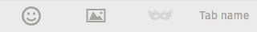

## Tabs

Tabs allow users to navigate between multiple views within a single screen. 

  <h4>Example</h4>
  <section class="example">
    
    <article class="tab frame"></article>
  </section>

  <h4>Css link</h4>
  <link href="(your styles folder)/themes/whatev/tabs.css" rel="stylesheet" type="text/css">
<link href="(your styles folder)/themes/whatev/icons.css" rel="stylesheet" type="text/css">

  <h4>HTML code</h4>
  

