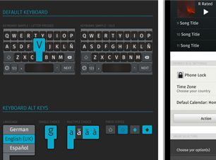
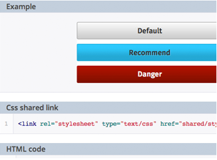
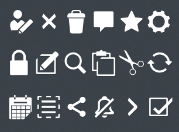

*    

    ## Design stencil kit

    Download all Firefox OS UI components in one single file and create quick mockups of your applications by just  making drag and drop. The layered PSD (Photoshop) contains editable effects, fonts and shapes so you can easily customize your app.

    [Download PSD (.zip)](https://dl.dropboxusercontent.com/s/vpzng18kz2iuea9/CommonControls.psd?dl=1)

*    

    ## Building Blocks

    Mockup your apps with the Design stencil kit and, when you’re satisfied with the results, use the same components available as Building Blocks . All the components you’ll find in the Design stencil kit have their equivalent as a HTML/CSS  Building Block.

    [Download All Building Blocks (.zip)](https://github.com/buildingfirefoxos/Building-Blocks/archive/gh-pages.zip)

    <a class="github" href="https://github.com/buildingfirefoxos/Building-Blocks">Github repository</a> 

*   

    ## Icon set

    You’ll find different icon sets, from primary action icons to communications, settings and media icons. They’re available as layered PSD files in vector format, so they’re ideal to be used in different devices no matter the screen size without loosing quality.
