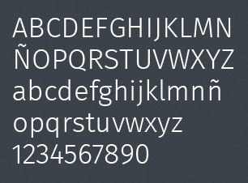

*    

    ## Design stencil kit

    Download all Firefox OS UI components in one single file and create quick mockups of your applications by just  making drag and drop. The layered PSD (Photoshop) contains editable effects, fonts and shapes so you can easily customize your app.

    <a onClick="_gaq.push(['_trackEvent', 'link', 'download', 'downloads - stencil kit']);" id="transitions-dl" href="https://mozilla.box.com/s/5ucf52a98q1rd20eu5lm">Design stencil kit (Photoshop file .zip)</a>

*    

    ## Building Blocks

    In this pack you will find all CSS, assets, icons and fonts used in Firefox OS as well as HTML examples on how to use them. These Building Blocks are CSS and HTML only. We are working in some Javascript to interact with them.

    <a onClick="_gaq.push(['_trackEvent', 'link', 'download', 'downloads - building blocks']);" href="https://github.com/buildingfirefoxos/Building-Blocks/archive/gh-pages.zip">Building Blocks (.zip)</a> 

    <a onClick="_gaq.push(['_trackEvent', 'link', 'github', 'downloads - building blocks']);" class="github" href="https://github.com/buildingfirefoxos/Building-Blocks">Github repository</a> 

    <a onClick="_gaq.push(['_trackEvent', 'link', 'market', 'downloads - building blocks']);" class="market" href="https://marketplace.firefox.com/app/building-blocks">Install the app</a> 

*   

    ## Icon set

    You’ll find different icon sets, from primary action icons to communications, settings and media icons. They’re available as layered PSD files in vector format, so they’re ideal to be used in different devices no matter the screen size without loosing quality.

    <a onClick="_gaq.push(['_trackEvent', 'link', 'download', 'downloads - action icons blocks']);" href="https://mozilla.box.com/s/jp5lrplbuont96ypm27q">Action Icons (Photoshop file .zip)</a> 

    <!--a onClick="_gaq.push(['_trackEvent', 'link', 'download', 'downloads - settings icons blocks']);" href="https://mozilla.box.com/s/flp11jpmu89c32lasm4u">Settings Icons (Photoshop file .zip)</a--> 

*   

    ## Fonts

    The default font used in Firefox OS is "Fira Sans". You will find it in four different weights: Light, Regular, Medium and Bold. Please, refer to the license file to check font's usage permissions.

    <a onClick="_gaq.push(['_trackEvent', 'link', 'github', 'downloads - feura']);" class="github" href="https://github.com/mozilla/Fira">Fira Sans</a>
