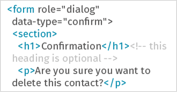

<ul>
  <li id="building-blocks">
    <a class="cell" href="building-blocks">
      <figure>
        
      </figure>
      <h3>Building Blocks</h3>
      
Reusable component set with markup and usage examples.

    </a>
  </li>
  <li id="transitions">
    <a class="cell" href="transitions" >
      <figure>
        
      </figure>
      <h3>CSS Transitions</h3>
      
Ready to use animations and transitions for your apps.

    </a>
  </li>
  <li id="downloads">
    <a class="cell" href="downloads">
      <figure>
        
      </figure>
      <h3>Downloads</h3>
      
Get all Firefox OS goodies! Design stencils, icons, fonts...

    </a>
  </li>
</ul>

#### Site updates

* Our first goal is to make all Building Blocks full functional in any browser. Yes, right now it’s only possible to see them at their full splendor using [Firefox Nightly](http://nightly.mozilla.org/). The good news is we’re almost there and will publish an update soon. [Contribute to this task](https://github.com/buildingfirefoxos/Building-Blocks) and help us deliver faster.
* We’re providing a [Design Stencil Kit](https://mozilla.box.com/s/5ucf52a98q1rd20eu5lm) in Photoshop format to kickstart Firefox OS app design. You can use it in combination with Building Blocks to design your apps and give them a Firefox OS look & feel. But we want to publish more UI themes: dark, flat, bright, vanilla... the sky’s the limit! [Contribute to this task](https://github.com/buildingfirefoxos/UI-Components) using the Firefox OS Design stencil kit as a base.
* We’ve put a lot of passion and hard work in this site, and we want it to be always open, free and truly useful for you. We know there’re loads of things that can be improved, so we encourage you to [contribute](https://github.com/buildingfirefoxos/site) to make Building Firefox OS better.
