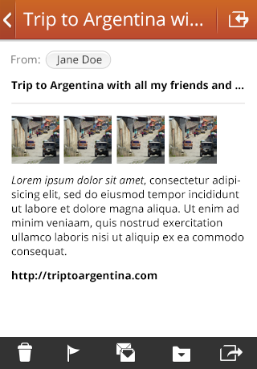

## App invokes app

<section class="transition">
  <article id="example-invoke" class="phone-frame">
    <section class="full frame dark">
      

        
        
      

      

      

        

          

          
        

        

          

          
        

      

    </section>
  </article>
  <label>CSS Animations:</label>
  
  
</section>