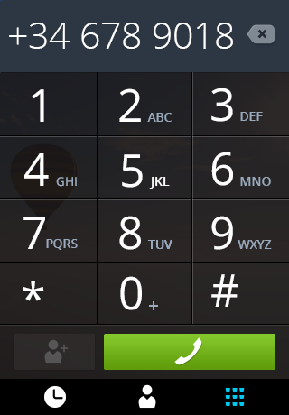
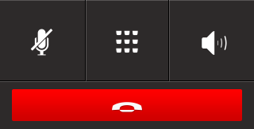

## Calls

  <ul>
    <li><a href="#calls-dialer">From dialer</a></li>
    <li><a href="#calls-home">From home</a></li>
    <li><a href="#calls-app">From app</a></li>
  </ul>

  

    <ul>
      <li><a href="#calls-dialer-make">Making a call</a></li>
      <li><a href="#calls-dialer-finish">Finishing a call</a></li>
    </ul>

    

      <section class="transition">
        <article id="example-call-1" class="phone-frame">
          

            
            
          

          <section class="full frame dark">
            

            

              

                
              

              

                
                
                
                

                  
              

          </section>
        </article>
        <label>CSS Animations:</label>
        
        
      </section>
    

    

      <section class="transition">
        <article id="example-call-2" class="phone-frame">
          

            
            
          

          <section class="full frame dark">
            

            

              

                
              

              

                
                
                
                

                  
              

            

          </section>
        </article>
        <label>CSS Animations:</label>
        
        
      </section>
    

  

  

    <ul>
      <li><a href="#calls-home-answer">Answering a call</a></li>
      <li><a href="#calls-home-finish">Finishing a call</a></li>
      <li><a href="#calls-home-reject">Rejecting a call</a></li>
    </ul>

    

      <section class="transition">
        <article id="example-call-3" class="phone-frame">
          

            
            
          

          <section class="full frame dark">
            

            

              

                
                
              

              

                
                
                
                
                

                  

                    
                

              

            

        </section>
      

    

    

      <section class="transition">
        <article id="example-call-4" class="phone-frame">

        </article>
      </section>
    

    

      <section class="transition">
        <article id="example-call-5" class="phone-frame">

        </article>
      </section>
    

  

  

    <ul>
      <li><a href="#calls-app-answer">Answering a call</a></li>
      <li><a href="#calls-app-finish">Finishing a call</a></li>
      <li><a href="#calls-app-reject">Rejecting a call</a></li>
    </ul>

    

      <section class="transition">
        <article id="example-call-6" class="phone-frame">

        </article>
      </section>
    

    

      <section class="transition">
        <article id="example-call-7" class="phone-frame">

        </article>
      </section>
    

    

      <section class="transition">
        <article id="example-call-8" class="phone-frame">

        </article>
      </section>
    

  

