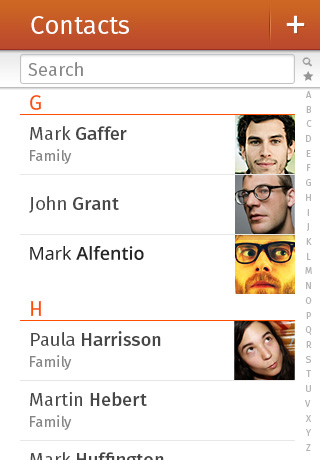

## In app navigation

Going deeper and back within an application

<section class="transition">
  <h4>Example</h4>
  <article id="example-deeper" class="phone-frame">
    

      
      
    

    <section class="full frame header">
      

      

        

          
        

        

          
        

      

    </section>
  </article>
</section>

<h4>CSS Animations</h4>

/*------- Go Deeper -------*/
animation: currentToLeft 0.4s forwards;
@keyframes currentToLeft {
  0%   { transform: translateX(0); }
  100% { transform: translateX(-100%); }
}
animation: rightToCurrent 0.4s forwards;
@keyframes rightToCurrent {
  0%   { transform: translateX(100%); }
  100% { transform: translateX(0); }
}
/*------- Go Back -------*/
animation: leftToCurrent 0.4s forwards;
@keyframes leftToCurrent {
  0%   { transform: translateX(-100%); }
  100% { transform: translateX(0); }
}
animation: currentToRight 0.4s forwards;
@keyframes currentToRight {
  0%   { transform: translateX(0); }
  100% { transform: translateX(100%); }
}