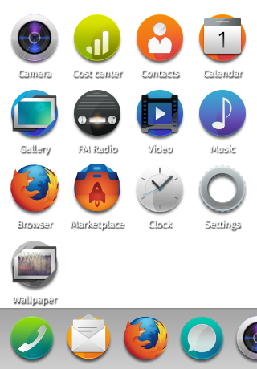
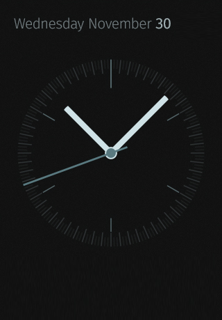

## Opening and closing apps

### Opening an app

<section class="transition">
  <h4>Example</h4>
  <article id="example-open" class="phone-frame">
    

      
      
    

    <section class="full frame">
      

      

        

          
          
        

        

          
        

      

    </section>
  </article>
</section>

<h4>CSS Animations</h4>

/* Scale icons */
animation: openAppIcons 0.3s forwards ease;
@keyframes openAppIcons {
  0%   { transform: scale(1.0); }
  100% { transform: scale(1.8); }
}

/* Show app */
animation: openApp 0.3s forwards ease;
@keyframes openApp {
  0%   { transform: scale(0.1); opacity: 0; }
  100% { transform: scale(1.0); opacity: 1; }
}

### Closing an app

<section class="transition">
  <h4>Example</h4>
  <article id="example-close" class="phone-frame">
    

      
      
    

    <section class="full frame">
      

      

        

          
          
        

        

          
        

      

    </section>
  </article>
</section>

<h4>CSS Animations</h4>

/* Scale icons */
animation: closeAppIcons 0.3s forwards ease;
@keyframes closeAppIcons {
  0%   { transform: scale(1.8); }
  100% { transform: scale(1.0); }
}

/* Hide app */
animation: closeApp 0.3s forwards ease;
@keyframes closeApp {
  0%   { transform: scale(1.0); opacity: 1; }
  100% { transform: scale(0.1); opacity: 0; }
}
