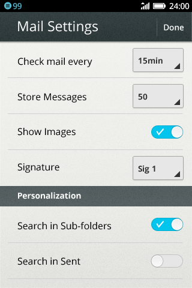
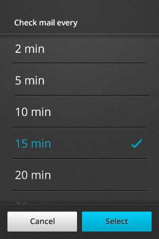

## Prompts

<section class="transition">
  <h4>Example</h4>
  <article id="example-modal" class="phone-frame">
    <section class="full frame dark">
      

        
        
      

      

        

            
        

        

            
        

      

    </section>
  </article>
</section>

<h4>CSS Animations</h4>

/* Launch Value Selector */
animation: fadeIn 0.2s forwards;
@keyframes fadeIn {
  0%   { opacity: 0; }
  100% { opacity: 1; }
}
/* Close Value Selector */
animation: fadeOut 0.2s forwards;
@keyframes fadeOut {
  0%   { opacity: 1; }
  100% { opacity: 0; }
}
