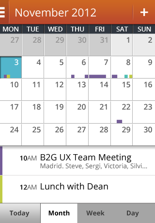
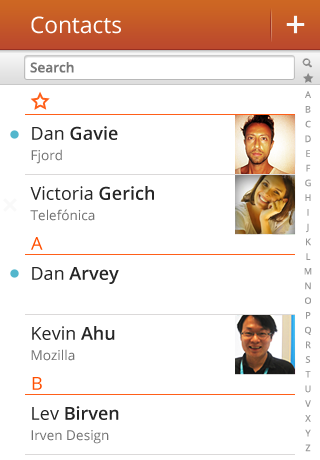

## Task switching

(SYSTEM TRANSITION)

  <ul>
    <li><a href="#task-navigation">Task navigation</a></li>
    <li><a href="#task-deleting">Deleting a task</a></li>
  </ul>

  

    <section class="transition">
      <article id="example-task" class="phone-frame">
        

          
          
        

        <section class="full frame dark">
          

          

            

              

              
              
Calendar

            

            

              

              
              
Contacts

            

            

              

              
              
Browser

            

          

        </section>
      </article>
    </section>
  

  

    <section class="transition">
      <article id="example-task-2" class="phone-frame">
        

          
          
        

        <section class="full frame dark">
          

          

            

              

              
              
Calendar

            

            

              

              
              
Contacts

            

            

              

              
              
Browser

            

          

        </section>
      </article>
    </section>
  

